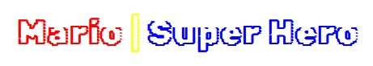
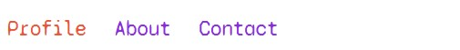
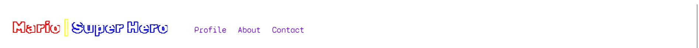
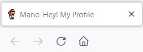
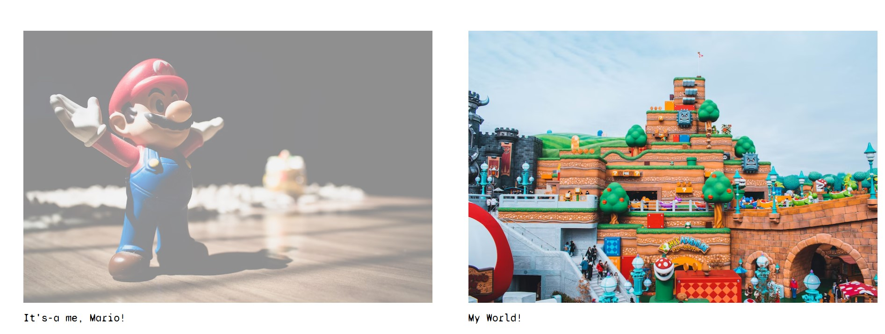
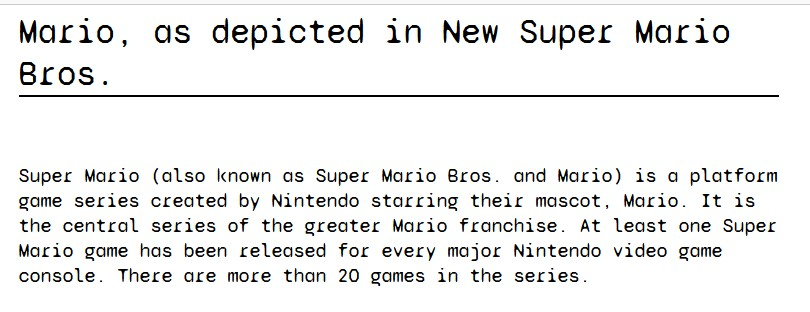
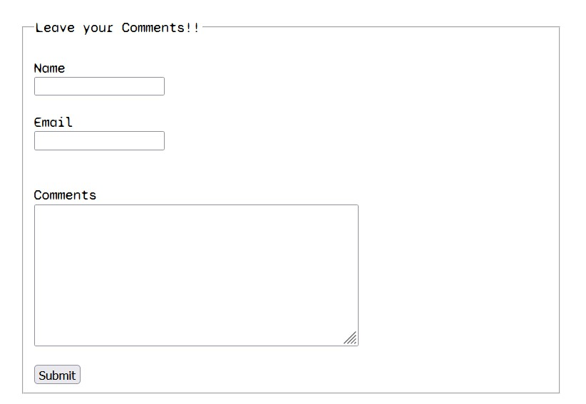
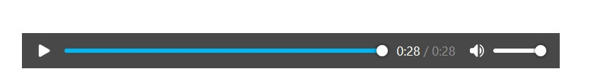

# Mario Portfolio

Inspired from old school mario underwater level/world game, created a static site using HTML & CSS. It's a portfolio of Mario character.

## :movie_camera: Demo

Click [here](https://mario-portfolio.onrender.com) to go to the application.👈:point_left:

## HTML Page & CSS Styling

**HTML Page**: Contains header, three sections, & footer:

1.  **<header>:** includes a `<h1>` tag for heading & `<nav`> tag for navbar('profile', 'about', 'contact')

    - **CSS**:

      - used Google font `Syne Mono` and used `span` tag inside `h1` to give different colors to each word.

      

      - `<nav>` includes `<ul>` list `<li>` of links `<a>` with `href` attribute as same as `#id` this will cause the browser to scroll to that element on the page.

      - used `:hover` property of `<a>` tag, to style the `cursor` as `grab` cursor also used `transition` for more styling on color when hover on links.

      

    

    - also in title bar included `icon` of mario

    

2.  **<section> main-body**: includes `
` tag to make look like card for all images using `` tag.

    - **CSS**:

    - used `box-sizing: border-box;` display inline and width approx 50% to make grid of images with proper padding and margin.

    - use a pusedo class of `` tag `:hover` so that when we hover on a image it's `opacity` should go half(0.5)

    

3.  **<section> about**: includes a `<h4>` and `
` tag '

    

4.  **form**: in footer created a `form` template to take user feedback and issues.

    - used `fieldset` and `legend`to draw a box around grouped element.

    

5.  **footer**: contact us section used `h3`, `p` for content & the `iframe` tag defines a rectangular region within the document in which the browser can display a separate document, including scrollbars and borders.

    

- also used <audio controls autoplay> to attach a mario theme song when we just load a page.

  
